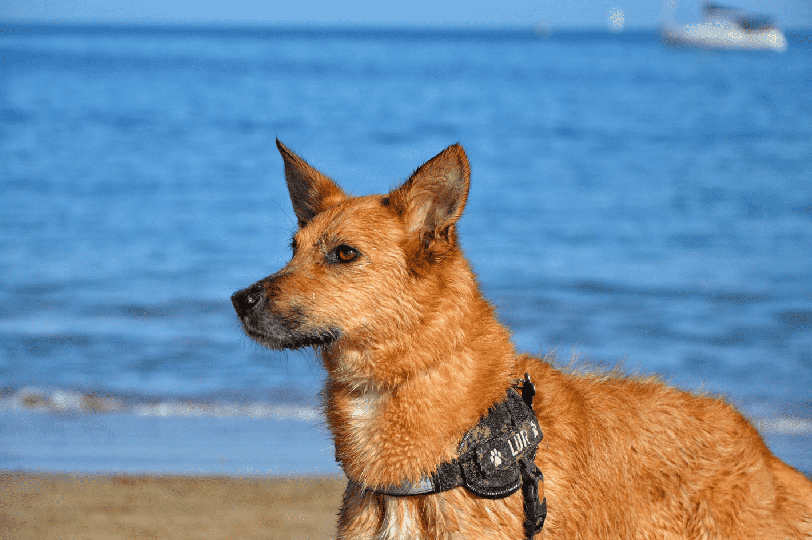

# Aplicación ```ANIMALIA``` :dog2: :cat2:
Es el proyecto que voy a desarrollar en el curso para llevar a cabo la gestión de una residencia de animales.

La documentación se encuentra en la [Wiki](https://git.institutomilitar.com/joseluispuentes82/residenciaanimales-api/wikis/home).




[DIM Sandstorm](https://dim.institutomilitar.com/) | [Programa semanal](https://web.institutomilitar.com/semanal.html) |  [DIM Web](https://web.institutomilitar.com/) | [Recursos Online DIM](https://web.institutomilitar.com/recursos-online.html)